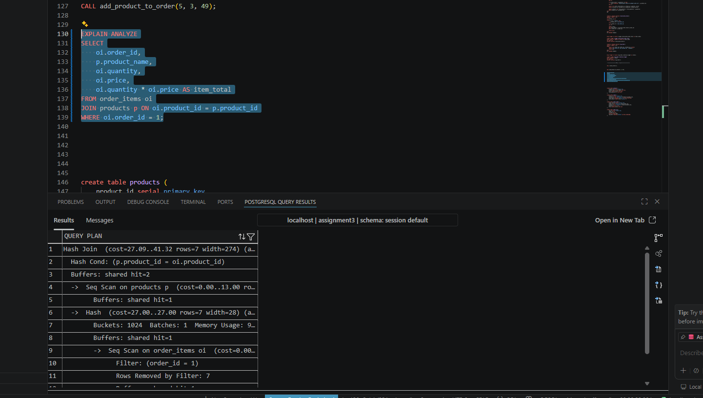
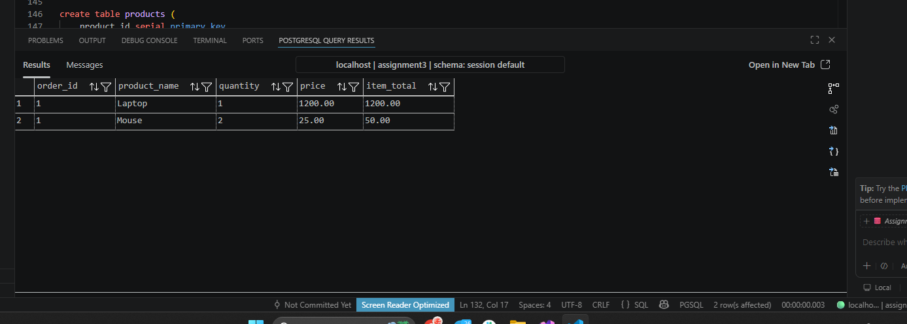

1.функція повертає значення, а процедура змінює таблички нічого не повертаючи
2. Ні не можна, бо він залежить від змін таблиць, а без цих змін він не спрацює
3. Плюс: швидкість(бо все виконується в середині і не треба шукати дані). Мінус: важко підтримувати код, тестувати і якщо мінаємо базу то треба переписувати все 

Explain Analyze

